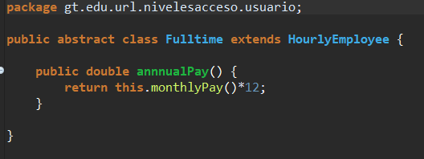

# Laboratorio 7

### Carlos Andrés Cuéllar Velásquez 2497117
       
## a) Bitácora

1.  Class Employee.

   1.1 Se crea la clase abstract Employee con sus 2 atributos y sus metodos.

 

2.  Class SalariedEmployee.

   2.1 Se crea la clase abstract SalariedEmployee con sus atributos y sus metodos.

 
 
 3.  Class Manager.

   3.1 Se crea la clase abstract Manager con su metodo.

 
 
  4.  Class Staff.

   4.1 Se crea la clase abstract Staff con su metodo.

 
 
  5.  Class HourlyEmployee.

   5.1 Se crea la clase abstract HourlyEmployee con sus 2 atributos y sus metodos.

 
 
 6.  Class Fulltime.

   6.1 Se crea la clase abstract Fulltime con su metodos.

 
 
 7.  Class PartTime.

   7.1 Se crea la clase abstract PartTime con su metodos.

 
